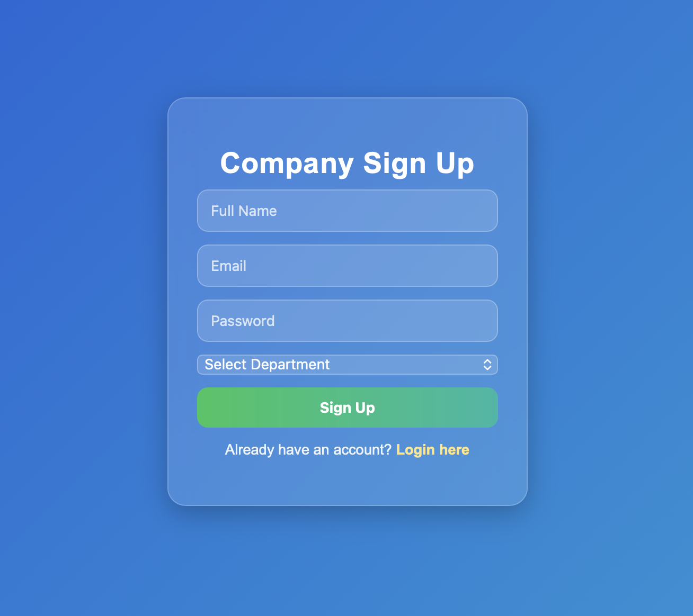
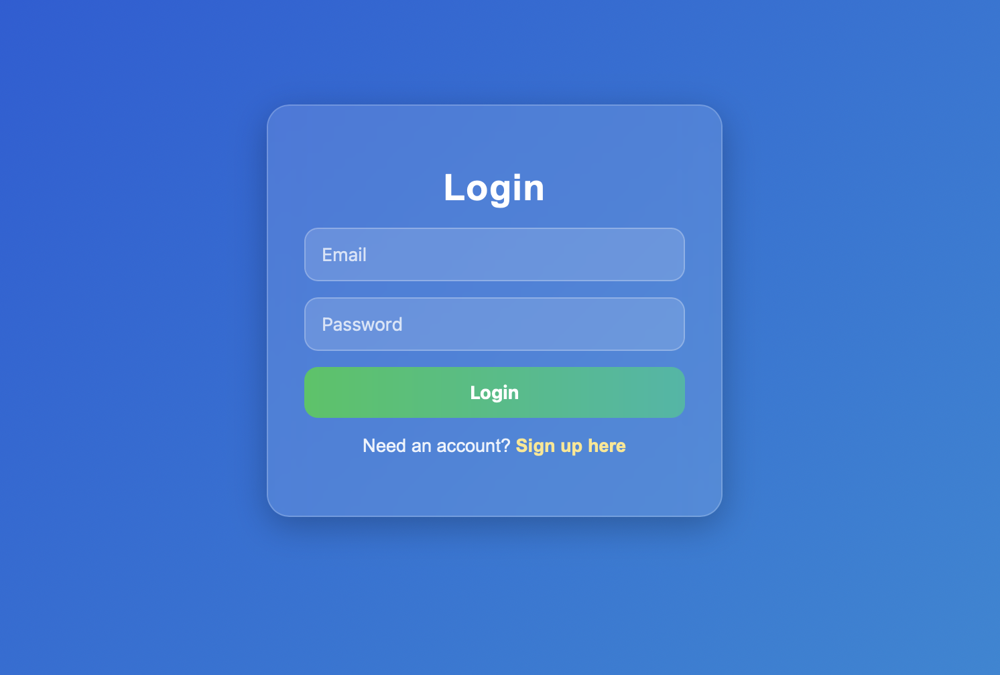
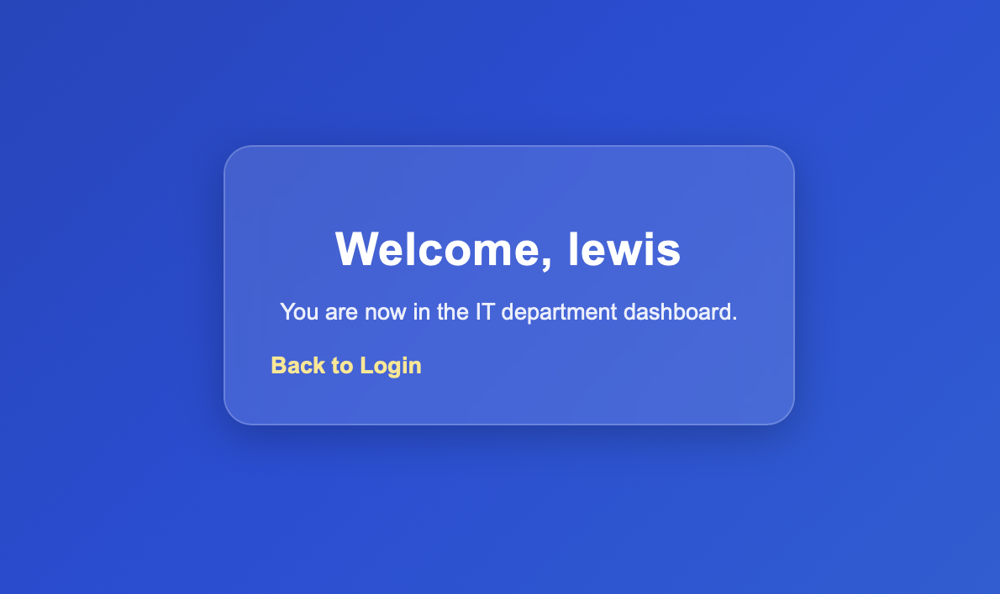
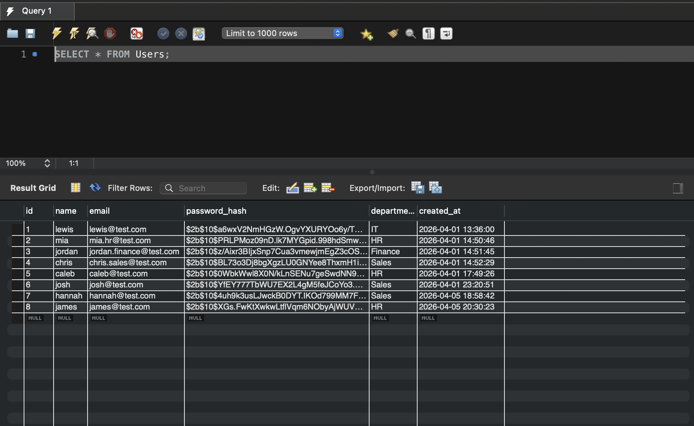
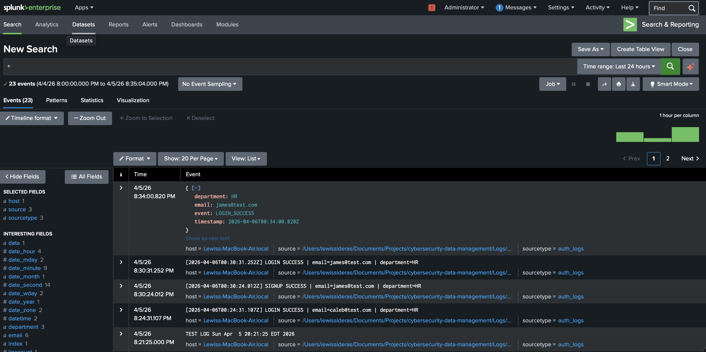

# User Authentication System with Department Routing, SQL Database, and Splunk SIEM Logging

This is a full stack authentication system that securely manages user login and signup while integrating with a SIEM platform for real time security monitoring. 

The system logs authentication events in a structured JSON format and visualizes them using dashboards in Splunk.

Tech Stack
- Frontend: HTML, CSS, JavaScript
- Backend: Node.js + Express
- Database: MySQL (Local)
- Logging: File based JSON logs
- SIEM: Splunk (Local instance with file monitoring)

What I Built
1. User opens signup page
2. User enters: name, email, password, department
3. Backend receives that data
4. Password gets hashed
5. User is stored in MySQL
6. User is sent to login page
7. Login checks if entered credentials match database
8. If correct, user goes to their department page
9. Logs get written for Splunk to monitor

SIEM Integration
- Splunk monitors log file in real time
- JSON field allows for structured analysis
- Queries allow detection of suspicious activity

Folder Explanations
- Public: This holds files the browser can open directly, HTML/ CSS.
- Routes: This holds backend route logic, signup and login handling.
- Database: This holds the database connection code.
- Logs: This holds log files for Splunk.
- server.js: This is the main file that starts the express app.

Core Test Links
1. Server Test
a. http://localhost:3000/
b. prints "main server works"
2. Auth Route Test
a. http://localhost:3000/auth/test
b. prints "auth router works"

Future Improvements
- Account lockout after repeated failed attempts
- Cloud deployment (Azure/ maybe AWS)
- Password reset feature
- Session based authentication (prevents URL spoofing)

Project Demonstration
- Application UI

- MySQL Database

- JSON Logs in Splunk

